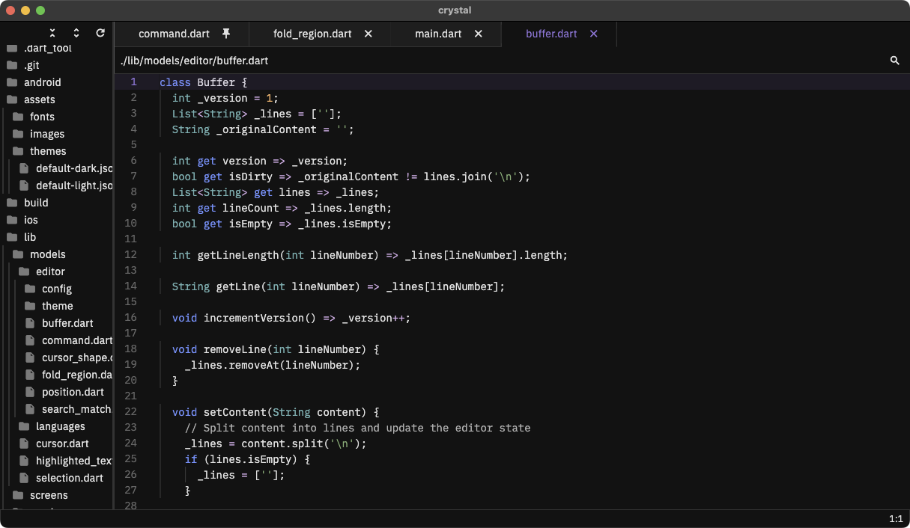

# Crystal

Crystal aims to be a lightweight yet powerful code editor.



## Features
- Fast and Lightweight
- Cross Platform (Windows, macOS, Linux)
- Built-in File Explorer
- Syntax Highlighting (basic)
- Search and Replace
- Multi-Cursor Editing
- Split Views
- Integrated Terminal
- Code Folding
- Breadcrumbs (Dart only for now)
- Minimap

### Planned Features
- Multiple Themes
- Git Integration
- Extensions
- Code Completion/Suggestions
- Custom Keybindings
- Integrated Debugger (?)
- Remote Development (?)

## Getting Started
To get started with Crystal, follow these steps:

1. Prerequisites:
   - Flutter SDK (latest stable version)

2. Clone the repository:
   ```
   git clone https://github.com/scarryaa/crystal.git
   cd crystal
   ```

3. Install dependencies:
   ```
   flutter pub get
   ```

4. Run the application:
   ```
   flutter run -d <PLATFORM>
   ```

## Contributing
Contributions are welcome.

## License
This project is licensed under the MIT License.
